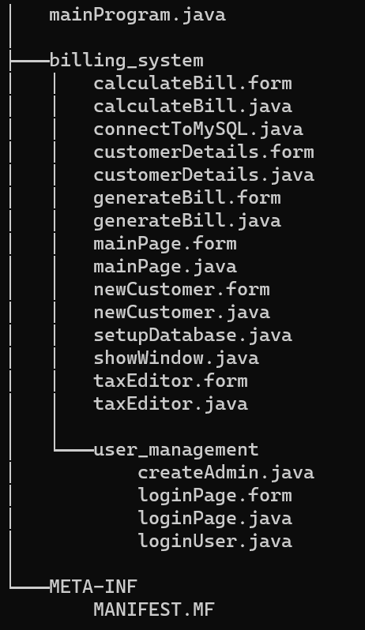
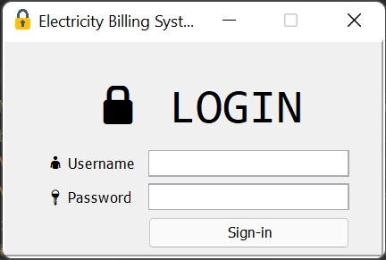
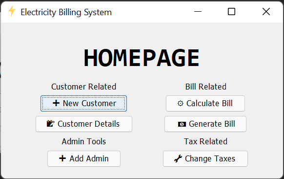
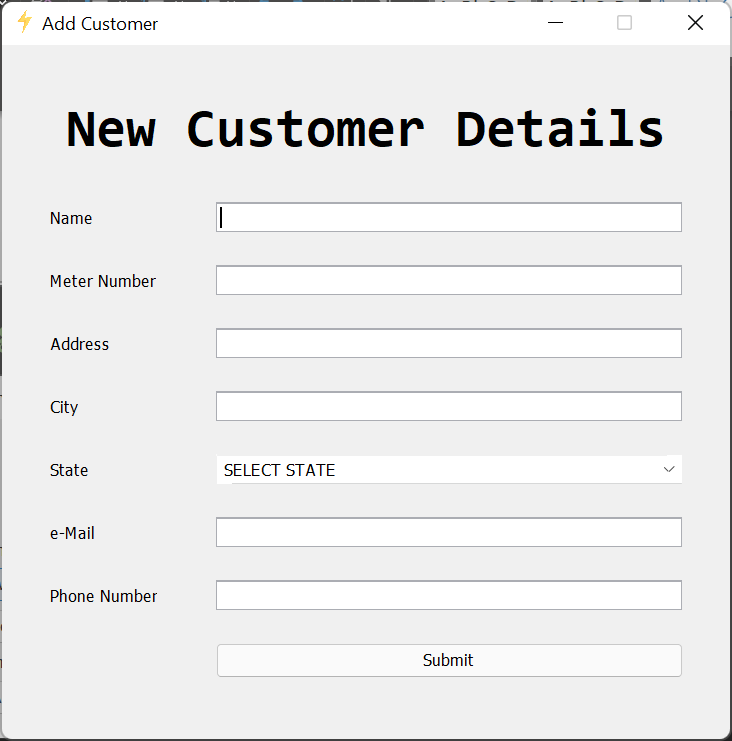
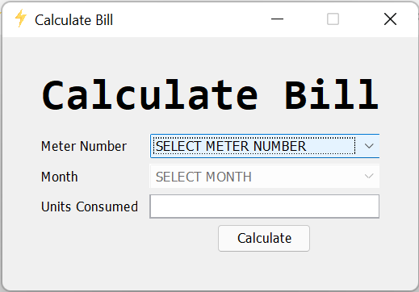
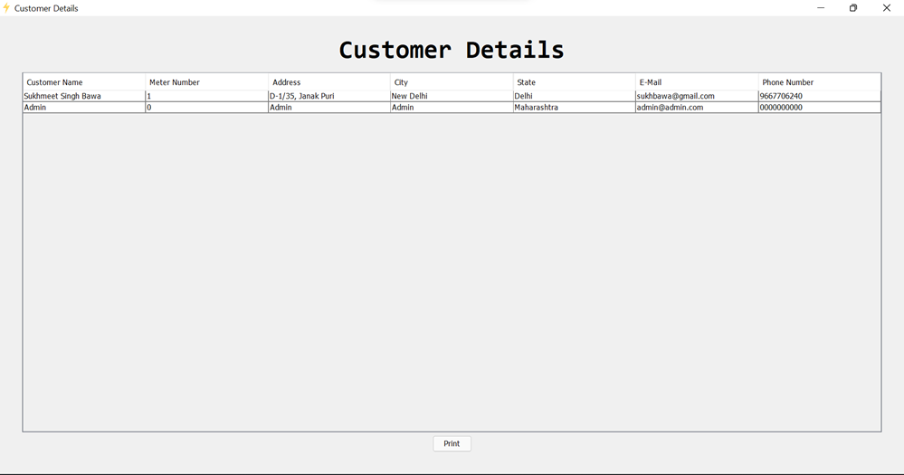
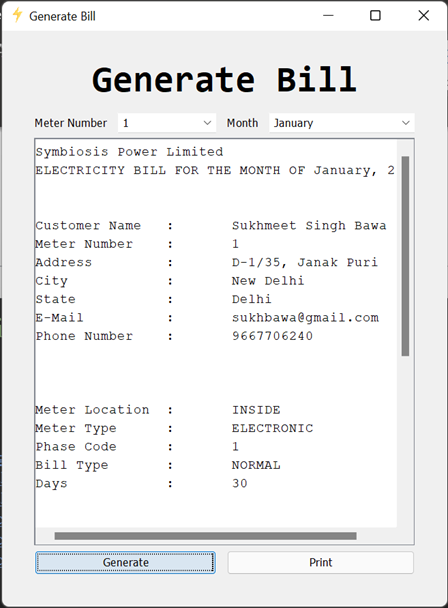
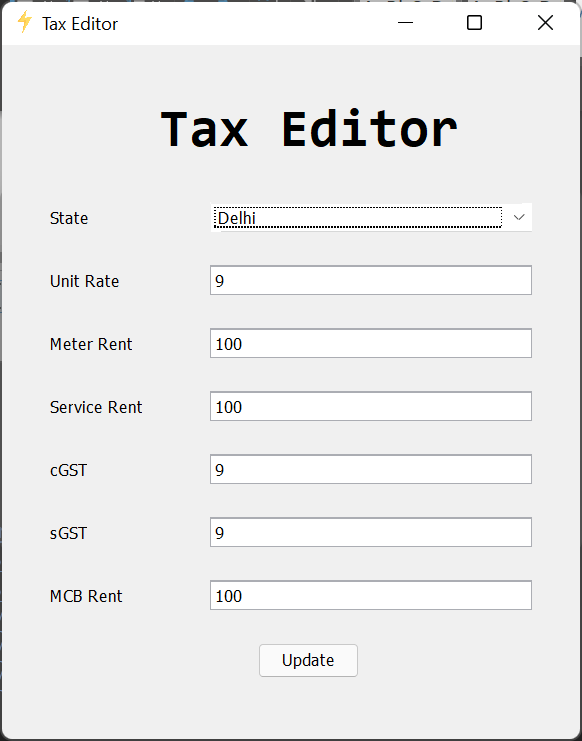
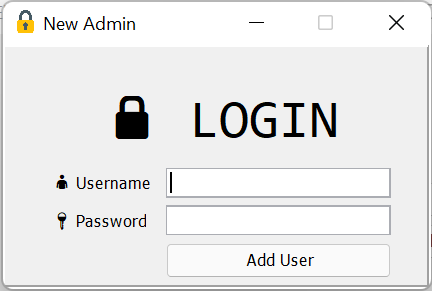

# Electricity Billing System

## Description

Electricity Billing System is a software-based application developed in Java programming language. The project aims at serving the department of electricity by computerizing the billing system. It mainly focuses on the calculation of Units consumed during the specified time and the money to be paid to electricity offices. This computerized system will make the overall billing system easy, accessible, comfortable and effective for consumers.

### Some of the features of this project

- To make the billing system more service-oriented and simple, the following features have been implemented in the project.
- The application has high speed of performance with accuracy and efficiency.
- It doesn’t require any staffs as in the conventional system. Once it is installed on the system, only the meter readings are to be given by the customer.
- The electricity billing software calculates the units consumed by the customer and makes bills.

* * *

# Project Structure

## Concepts used for this Project

- Classes
- Inheritance
- Data Encapsulation
- Exception Handling
- Abstraction
- Interface

## Prerequisites

- IntelliJ
- MySQL

* * *

# Output

- Login Screen
    
- Home Page
    
- New User Details
    
- Calculate Bill
    
- Customer Details
    
- Generate Bill
    
- Tax Editor
    
- Add Admin
    